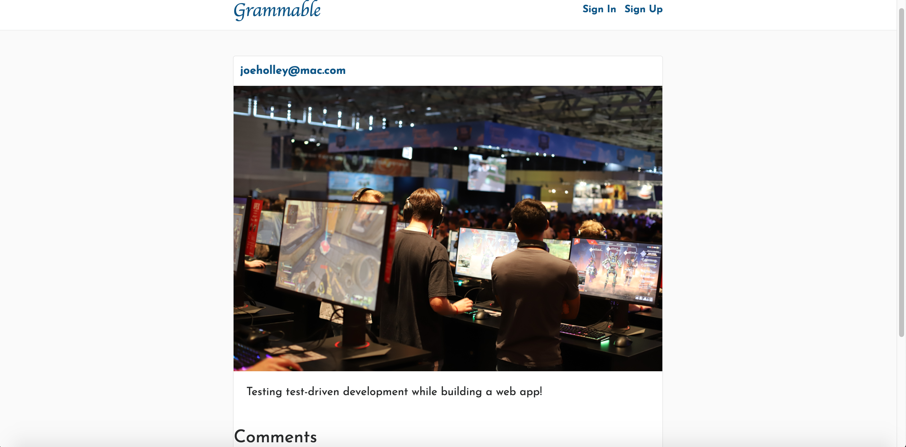

# README

# [Grammable](https://grammable-joe-holley.herokuapp.com/)

An Instagram clone that was built using industry-standard, test-driven development following numerous red/green/refactor cycles.

#### Built using:
- Ruby v2.5.3
- HTML5
- CSS
- Bootstrap 4.0.0.alpha6
- JQuery
- Popper JS
- Font Awesome

#### Ruby Gems used:

- Carrierwave
- Figaro
- Simple-Form
- Devise
- Spring Commands R-Spec

### Home Page:

https://grammable-joe-holley.herokuapp.com/